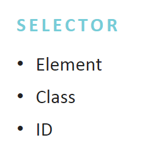
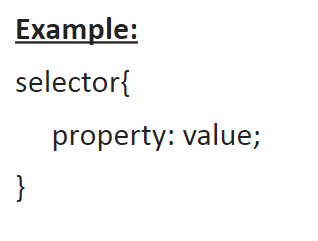
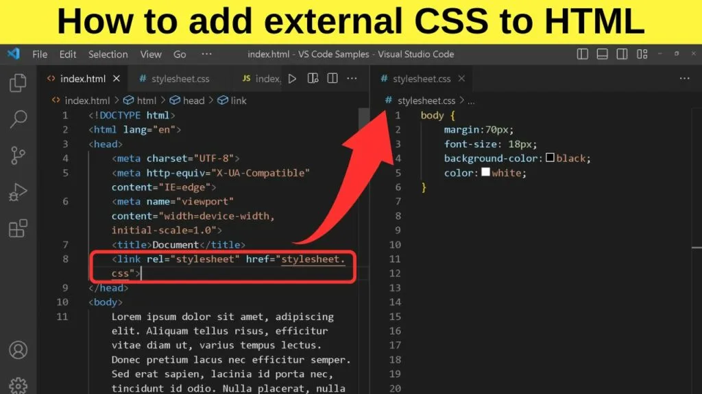
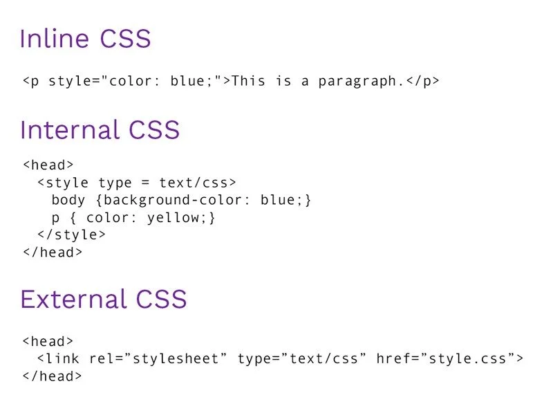
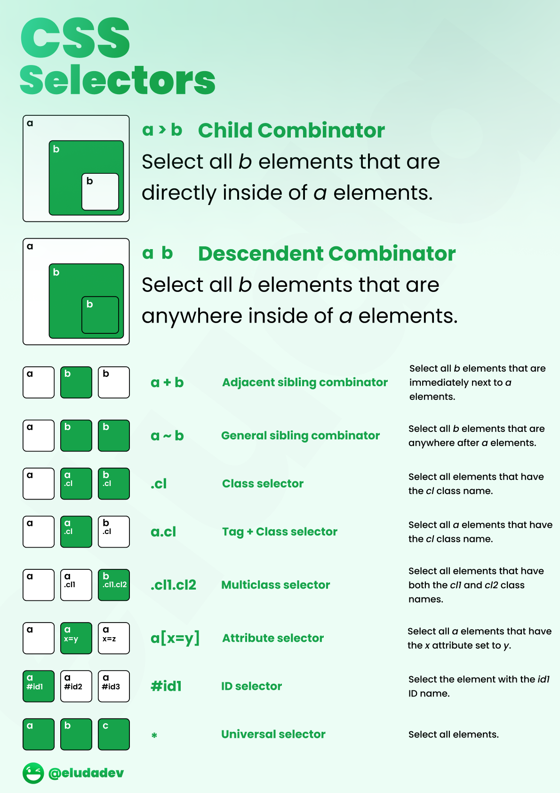
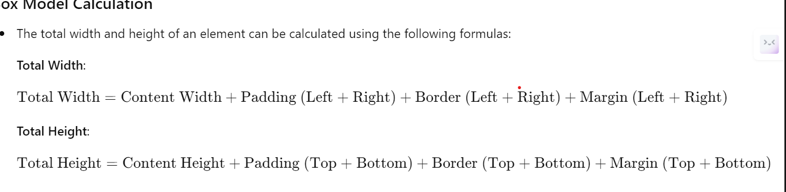
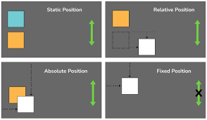
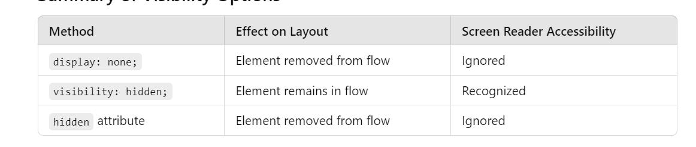

# CSS(Cascading Style Sheet)

is a stylesheet language used to describe the presentation of a document written in HTML or XML 

- `Cascading and Inheritance:` The "cascading" aspect means that multiple styles can be applied to the same element, and the browser determines which styles to apply based on rules of specificity and importance. Styles can also inherit properties from their parent elements.

### Deauflt browser styles

Default browser styles refer to the default CSS rules applied by web browsers to HTML elements.

- `Margin:` Typically set to 8px for paragraphs and headings.

- `Padding:` Default padding is usually 0 for most elements
- `Font Size:` Default font size is generally 16px for the body text.
- `Line Height:` Commonly set to 1.2 or normal.
- `List Style:` Unordered lists have default bullet points, while ordered lists use numbers.
- `Background Color:` Default is often transparent (rgba(0, 0, 0, 0)).
- `Color:` Default text color is usually black (#000 or rgb(0, 0, 0)).
- `Text Decoration: `Links have text-decoration: underline by default.
- `Border:` Most elements have no default border (0).
- `Display:` Block-level elements (like `<div> and <h1>`) default to display: block, while inline elements (like `<span> and <a>`) default to display: inline.

#### CSS Syntax

CSS syntax consists of three main components: selectors, properties, and values. Here’s a brief overview:

- `Selector:` Targets the HTML element(s) to apply styles (e.g., h1, .class, #id).
- `Property: `Defines the style attribute to change (e.g., color, font-size, margin).
- `Value:` Specifies the value for the property (e.g., blue, 16px, 10%).






### css apply 

- inline
- internal
- external
  
  

### Seclector types




Child Combinator (a > b)

```html
<a>
  <b>Direct Child</b>
  <div><b>Not Direct Child</b></div>
</a>
```
```css
a > b {
  color: blue;
}
```

Descendent Combinator (a b)
```html
<a>
  <b>Descendent</b>
  <div><b>Descendent</b></div>
</a>
```
```css
a b {
  color: red;
}
```
Adjacent Sibling Combinator (a + b)
```html
<a>First</a>
<b>Adjacent Sibling</b>
<b>Not Selected</b>
```
```css
a + b {
  color: green;
}
```

General Sibling Combinator (a ~ b)
```html
<a>First</a>
<b>General Sibling</b>
<b>Another Sibling</b>```
```css
a ~ b {
  color: purple;
}
```

Class Selector (.cl)
```html
<div class="cl">Class Element</div>
```
```css
.cl {
  background: yellow;
}
```
Tag + Class Selector (a.cl)

```html
<a class="cl">Tag and Class</a>
<div class="cl">Not Selected</div>
```
```css
a.cl {
  font-weight: bold;
}
```
Multiclass Selector (.cl1.cl2)

```html
<b class="cl1 cl2">Both Classes</b>
<b class="cl1">Not Selected</b>
```
```css
.cl1.cl2 {
  border: 1px solid black;
}
```
Attribute Selector (a[x=y])
```html
<a x="y">Attribute Selected</a>
<a x="z">Not Selected</a>
```
```css
a[x="y"] {
  text-decoration: underline;
}
```
ID Selector (#id1)

```html
<div id="id1">Unique ID</div>
```

```css
#id1 {
  color: orange;
}
```
Universal Selector (*)

```html
<a>All Elements</a>
<b>All Elements</b>
<c>All Elements</c>
```
```css
* {
  margin: 0;
}
```

### CSS3 Features

- flex box
- box model
- media queries
- css grid
- animation
- font


### CSS BOX Model

describes how the layout of elements is structured on a web page

- `content box` This is the innermost part of the box model

- `padding box` The padding is the space between the content and the border (top, right, bottom, left)

- `boder box` The border surrounds the padding and content area. It can be styled with color, width, and style (solid, dashed, etc.) 

- `margin box` The margin is the outermost space around the element, creating a gap between this element and others. It is transparent and does not affect the background of the element.





#### Box-Sizing Property
By default, the box model includes padding and borders in the total width and height of an element. However, you can change this behavior using the box-sizing property:

```css
box-sizing: content-box; /* Default, width/height apply to content only */

box-sizing: border-box; /* Width/height include padding and border */
```

// comments

/* comments */

```css
.box {
    margin: 10px;              /* All sides 10px */
}

.container {
    margin: 10px 20px;        /* 10px top and bottom, 20px left and right */
}

.element {
    margin: 10px 20px 30px;   /* 10px top, 20px left and right, 30px bottom */
}

.card {
    margin: 10px 20px 30px 40px; /* 10px top, 20px right, 30px bottom, 40px left */
}
```
### Position in CSS




`Offset:` top, right, bottom, and left to adjust its position.

static is deafult cannot apply offset

relative relattive to its normal position (it does not leave space)

absolute to its positioned(excluding static) parent (it leaves space)

```css
.container {
    position: relative; /* Positioned ancestor */
}
.element {
    position: absolute;
    top: 10px; /* 10px from the top of the nearest positioned ancestor */
    right: 20px; /* 20px from the right of the nearest positioned ancestor */
}
```

fixed 

sticky is hybrid of relative and fixed  `The element is treated as relative until it reaches a defined scroll position, at which point it becomes fixed`


### Dispaly

When an element is set to `display: none;`, it is completely removed from the document flow. This means it does not occupy any space on the page.

```css
.container {
    display: flex; /* Creates a flex container */
}

.item {
    display: block; /* Each item takes the full width available */
}

.inline-item {
    display: inline; /* Items sit next to each other */
}

.hidden {
    display: none; /* This item is hidden from the page */
}
```

When an element is set to `visibility: hidden;`, it is hidden from view but still occupies space in the document layout.

The `hidden` attribute is a boolean attribute that can be added to any HTML element to hide it. It has the same effect as setting style="display: none;".


- display table

```html
<div class="table">
    <div class="table-row">
        <div class="table-cell">Row 1, Cell 1</div>
        <div class="table-cell">Row 1, Cell 2</div>
        <div class="table-cell">Row 1, Cell 3</div>
    </div>
    <div class="table-row">
        <div class="table-cell">Row 2, Cell 1</div>
        <div class="table-cell">Row 2, Cell 2</div>
        <div class="table-cell">Row 2, Cell 3</div>
    </div>
    <div class="table-row">
        <div class="table-cell">Row 3, Cell 1</div>
        <div class="table-cell">Row 3, Cell 2</div>
        <div class="table-cell">Row 3, Cell 3</div>
    </div>
</div>
```
```css
.table {
    display: table; /* Mimics the behavior of a table */
    width: 100%; /* Full width of the container */
    border-collapse: collapse; /* Collapse borders for a cleaner look */
}

.table-row {
    display: table-row; /* Each row behaves like a table row */
}

.table-cell {
    display: table-cell; /* Each cell behaves like a table cell */
    padding: 10px; /* Space inside cells */
    border: 1px solid #ccc; /* Border for each cell */
    text-align: center; /* Center align text */
}
```



#### float 

- float:left
- float:right
- float:none
- float:inherit

```css
.container {
    width: 80%; /* Set a width for the container */
    margin: 0 auto; /* Center the container */
}

.float-img {
    float: left; /* Float the image to the left */
    margin-right: 10px; /* Add some space to the right of the image */
}
```

Clearing Floats

- `clear: both` When using floats, it’s essential to clear them to avoid layout issues. Floated elements can affect the height of their parent container. To fix this, you can use the clear property or a clearfix technique.

## Pseudo Classess

Pseudo-classes are used to define the special state of an element. They are prefixed with a colon (:) and allow you to target elements based on their state or position in the document.

- :hover
- :active
- :focus
- nth-child 
- first-child last-child
- not(selector) 
- [Refer](https://codepen.io/Shraddhakesari/pen/VymMaE)

## Pseudo-Elements


Pseudo-elements are used to style specific parts of an element. They are prefixed with two colons (::) in modern CSS (though one colon : is still widely supported for backward compatibility).

- before
- after
- first-line
- fist-letter


## Flex box 


