# HTML

HTML is a **markup language** that is used to structure and display content on the web, utilizing a system of **elements (tags)** to define the hierarchy, organization, and formatting of the page's components.

#### MarkUp Language

<mark>dfj</mark>

`fjk`

<span style="background-color: #FFFF00">Marked text</span>

A **markup language** is a type of language used to annotate text or data in a way that is syntactically distinguishable from the text itself. These annotations (or "markups") define the structure and presentation of text or data, often in digital documents or web pages.

### Features of HTML
1. **Standard Language for Web Pages**
2. **HTML Elements and Tags**
3. **Semantic Structure**
4. **Markup Language, Not a Programming Language**
5. **Compatibility with Web Technologies**
6. **Platform Independent**
7. **Support for Multimedia**
8. **Hyperlinks for Navigation**
9. **Open Standard**
10. **Extensible with Modern Features**

### Main Points

1. **Markup language ≠ Programming language**
2. **Hypertext** is text displayed on a computer display or other electronic devices with references.
3. **HTML** is the **standard markup language** for creating Web pages.
4. **HTML** describes the **structure** of a Web page.
5. **HTML** consists of a series of **elements**.
6. **HTML elements** tell the browser how to display the content.


#### TAG
 A tag is a part of the HTML syntax that defines the start and end of an HTML element. Tags are enclosed in angle brackets (< >).
 

##### Types
* Start 
* end


```html
<h1>This is a heading</h1>
```

[Refer for all tags](https://www.w3schools.com/TAGS/default.asp)
###  Element 

An element refers to a complete structure in HTML, which includes the start tag, end tag, and the content in between. Elements represent the building blocks of an HTML document.

###  Components
* Start tag
* Content
* End Tag
  

```html
<h1>This is a heading</h1>
```

### HTML Comments

```html
<!--Comment content-->
```
### Attributes

Extend the capabilities of individual tags.
The order of the attributesdoesn’t matter

```html
<tag attribute1="value"attribute2="value">...</tag>
<div id = 'container'>Hello</div>
```
#### Examples

id, class, name, title, style, src, type

#### without quotes
```html
<p title=About W3Schools>This is a paragraph.</p>
```
While some browsers may allow the following unquoted value but this is not recommended because it may cause issues in certain cases, especially if your attribute value contains spaces or special characters.

#### Src attributes types
1. `Absolute`  links to another website
2. `Relative`  links to same website 
* without slash src ='img_boy.jpeg' relative to current page
* with slash src ='/img_boy.jpeg' relative to current domain

### lang attribute
to declare the language of the Web page. This is meant to assist search engines and browsers.

```html
<html lang="en-US">
```
`US` is country code

[Refer](https://www.w3schools.com/html/html_attributes.asp)


#### <!DOCTYPE>

Element <!DOCTYPE> is intended to indicate the type of the document-DTD(document type definition), for the browser to know how to parse the page.

There are several versions HTML/XHTML(eXtensible HyperText Markup Language),as well as HTML5,which differ in syntax.

The <!DOCTYPE> declaration is not an HTMLtag, it is an instruction to the web browser about what version of HTML the page is written in.

* It it is not mentioned or kept in somewhere it goes into `Quirks` mode causes the browser to render the page using outdated and inconsistent rules,
* It is case in sensitive 
* No closing tag

```html
<!DOCTYPE html>
```
### Web Page Structure
## HTML Structure

```html
<html>
  This is a container that includes the entire page content. There are always two sections on the page: head and body.

  <head>
    Contains information about the HTML file: the name of the page, style, meta tags and additional information.
  </head>

  <meta>
    Meta tags that contain information for browsing and retrieval systems (charset, description, keywords) for SEO, Open Graph, etc.
  </meta>

  <body>
    Contains all the text and tags that are displayed on the page.
  </body>
</html>
```

## HTML Layout Elements

HTML has several **semantic elements** that define the different parts of a web page:

## HTML5 Semantic Elements

- `<header>` - Defines a header for a document or a section.
- `<nav>` - Defines a set of navigation links.
- `<section>` - Defines a section in a document.
- `<article>` - Defines an independent, self-contained content.
- `<aside>` - Defines content aside from the main content (like a sidebar).
- `<footer>` - Defines a footer for a document or a section.
- `<details>` - Defines additional details that the user can open and close on demand.
- `<summary>` - Defines a heading for the `<details>` element.

### Example:

```html
<header>
  <h1>This is a header</h1>
</header>

<nav>
  <ul>
    <li><a href="#home">Home</a></li>
    <li><a href="#about">About</a></li>
  </ul>
</nav>

<section>
  <h2>This is a section</h2>
  <p>This section contains some information.</p>
</section>

<article>
  <h2>This is an article</h2>
  <p>This is independent content.</p>
</article>

<aside>
  <p>This is a sidebar with related content.</p>
</aside>

<footer>
  <p>This is the footer of the page.</p>
</footer>

<details>
  <summary>More details</summary>
  <p>Here is some additional information that can be expanded or collapsed.</p>
</details>
```
`example` for flexbox layout is in `practice.html` line no `188-213` and css for that is in `xs.css `line no `260-281`

### Meta Tag

[Refer](https://chatgpt.com/share/6704c1fe-0f94-8011-a308-c88ed6d54448)

# Block and Inline Elements


| **Block-Level Elements** | **Inline Elements** |
|--------------------------|---------------------|
| Always starts on a new line. | Does not start on a new line. |
| Takes up the full width available (stretches out to the left and right as far as it can). | Only takes up as much width as necessary. |
| Has a top and a bottom margin. | Does not have top and bottom margins. |


## HTML Lists

### 1. Ordered List

```html
<ol type='I' start='20' reversed>
    <li>item1</li>
    <li>item2</li>
</ol>
```

### 2. Unoderd List

```html
<ul>
    <li>item1</li>
    <li>item2</li>
</ul>
```

### 3. Description List


```html
<dl>
    <dt>title</dt>
    <dd>item2</dd>
</dl>
```

### Elements in the page

#### Images

```html

```

#### Links
```html
<a href="http://www.epam.com/">Go toEpam</a>
```

#### Image inside 
```html
<a href="http://www.epam.com/">
    
</a>
```

* **Importatnt Points on image**
* inserts a graphical image into pages
* src attribute 
*  * realtive url
*  * absoulte url 
*  If `width` and `height` is not specified it will take actual size

#### Src attributes types
1. `Absolute`  links to another website
2. `Relative`  links to same website 
* without slash src ='img_boy.jpeg' relative to current page
* with slash src ='/img_boy.jpeg' relative to current domain

### Anchor attributes

* href elements must be a valid url `(req*)`
* tagret `(optional)` deafult `self`
* _self: Opens the link in the same frame as it was clicked (this is the default behavior).
* _blank: Opens the link in a new tab or window.
* _parent: Opens the link in the parent frame.
* _top: Opens the link in the full body of the window
* framename: opens the linked document in a named frame
* If `_` is not specified it will open unique tab.
* The `type` attribute, if present, gives theMIME type of the linked resource.Thevalue must be a valid mime type `eg html/text
`
* `download `if present, indicates that the author intends the hyperlink to be used for downloading a resource.
* `Anchor` A hash mark (#), specifies an internal target location (an ID of an HTML element) within the current document. URLs are not restricted to Web (HTTP)-based documents, but can use any protocol supported by the browser.


* 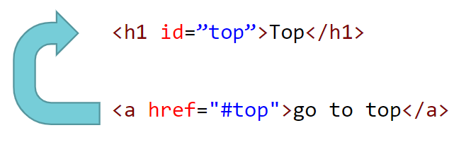


| Attribute  |  | Description                                                                                  |
|------------|------------|----------------------------------------------------------------------------------------------|
| alternate  |            | Provides a link to an alternate representation of the document (i.e., print page, translated, or mirror) |
| author     |            | Provides a link to the author of the document                                               |
| bookmark   |            | Permanent URL used for bookmarking                                                           |
| next       |            | Provides a link to the next document in the series                                           |
| nofollow    |            | Links to an unendorsed document, like a paid link. ("nofollow" is used by Google to specify that the Google search spider should not follow that link) |
| noreferrer |            | Requires that the browser should not send an HTTP Referer header if the user follows the hyperlink |
| noopener   |            | Requires that any browsing context created by following the hyperlink must not have an opener browsing context |
| prev       |            | The previous document in a selection                                                         |
| search     |            | Links to a search tool for the document                                                     |
| tag        |            | A tag (keyword) for the current document                                                    |


### Anchor For Phone link,Email link,Skype link

```html
<a href="tel:+04951234567">+0 (495) 123-45-67</a>
<a href="mailto:example@mail.com">example@mail.com</a>
<a href="skype:someskype?call">someskype</a>
```


# HTML Tables
It is used as a container for elements that define the contents of the table.

* row `<tr>`
* heading `<th>`
* table cell `<td>`
* default th is bold and centered 

### rowspan
Attribute used to combine neighboring columns in the table

###  colsspan 
Attribute used to combine neighboring columns in the table

### Inside Table elements

* `<caption>`
* `<col>`
* `<colgroup>`
* `<tbody>`
* `<td>`
* `<tfoot>`
* `<th>`
* `<thead>`
* `<tr>`

* changing the order still remains same
* for 2nd col only color
```html
<table>
        <caption>Table Title</caption>
        <colgroup>
            <col>
          <col style="background-color: lightgrey">
        </colgroup>
        <thead>
            <tr>
              <th>Header 1</th>
              <th>Header 2</th>
            </tr>
          </thead>
        <tbody>
          <tr>
            <td>Data 1</td>
            <td>Data 2</td>
          </tr>
        </tbody>
        <tfoot>
          <tr>
            <td>Footer 1</td>
            <td>Footer 2</td>
          </tr>
        </tfoot>
</table>
```
* for span first 2 cols 
```html
<table>
        <caption>Table Title</caption>
        <colgroup>
          <col span = '2' style="background-color: lightgrey">
        </colgroup>
        <thead>
            <tr>
              <th>Header 1</th>
              <th>Header 2</th>
            </tr>
          </thead>
        <tbody>
          <tr>
            <td>Data 1</td>
            <td>Data 2</td>
          </tr>
        </tbody>
        <tfoot>
          <tr>
            <td>Footer 1</td>
            <td>Footer 2</td>
          </tr>
        </tfoot>
</table>
```

* row span
```html
  <table>
        <caption>Table Title</caption>
        <colgroup>
            <col>
          <col style="background-color: lightgrey">
        </colgroup>
        <thead>
            <tr>
              <th>Header 1</th>
              <th>Header 2</th>
            </tr>
          </thead>
        <tbody>
          <tr>
            <td>Data 1</td>
            <td rowspan='2'>Data 2</td>
          </tr>
          <tr>
            <td>Data 1</td>
          </tr>
        </tbody>
        <tfoot>
          <tr>
            <td>Footer 1</td>
            <td>Footer 2</td>
          </tr>
        </tfoot>
</table>
```

* col span 
  ```html
  <table>
        <caption>Table Title</caption>
        <colgroup>
            <col>
          <col style="background-color: lightgrey">
        </colgroup>
        <thead>
            <tr>
              <th>Header 1</th>
              <th>Header 2</th>
            </tr>
          </thead>
        <tbody>
          <tr>
            <td>Data 1</td>
            <td >Data 2</td>
          </tr>
          <tr>
            <td colspan ='2'>Data 1</td>
          </tr>
        </tbody>
        <tfoot>
          <tr>
            <td>Footer 1</td>
            <td>Footer 2</td>
          </tr>
        </tfoot>
</table>
```

## Elements with no semantic meaning

* `div` (block) container abbraviation `division`
* `span` (inline) container

## Special Characters and Signs

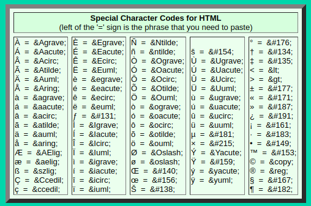

## HTML5 Features

* `Semantics:` allowing you to describe more precisely what your content is.
* `Connectivity:` allowing you to communicate with the server in new and innovative ways.
* `Offline and storage:` allowing webpages to store data on the client-side locally and operate offlinemore efficiently
* Multimedia: making video and audio first-class citizens in the Open Web.
* `2D/3D graphics and effects:` allowing a much more diverse range of presentation options.
* `Performance and integration:` providing greater speed optimization and better usage of computerhardware.
* `Device access:` allowing for the usage of various input and output devices.
* `Styling:` letting authors write more sophisticated themes

## Here are examples for each of the HTML5 features mentioned:

## Semantics:
HTML5 introduces new semantic elements that describe the structure of the document more clearly.

Example:
```html
<article>
  <header>
    <h1>Breaking News</h1>
    <p>Published on: October 8, 2024</p>
  </header>
  <p>HTML5 offers new semantic elements to create more meaningful content structures.</p>
</article>
```
`<article>, <header>`: These elements help define sections of the content and make it more readable for both developers and search engines.

## Connectivity:
HTML5 provides new ways for browsers to communicate with servers using technologies like WebSockets and Server-Sent Events (SSE).

Example:
```html
<script>
  const socket = new WebSocket('ws://example.com');
  socket.onopen = () => {
    socket.send('Hello Server!');
  };
</script>
```
WebSocket: This allows for real-time communication between the browser and the server.

## Offline and Storage:
HTML5 supports local storage and offline capabilities through technologies like Web Storage and Service Workers.

Example:
```html
<script>
  localStorage.setItem('username', 'JohnDoe');
  let user = localStorage.getItem('username');
  console.log(user); // Outputs: JohnDoe
</script>
```
LocalStorage: Allows web applications to store data on the client-side that persists even after the browser is closed.

## Multimedia:
HTML5 introduces native support for multimedia elements like `<video> and <audio>` without the need for third-party plugins.

Example:
``` html
<video controls>
  <source src="movie.mp4" type="video/mp4">
  Your browser does not support the video tag.
</video>
```
`<video>:` Allows embedding of videos directly into the webpage.

## 2D/3D Graphics and Effects:
HTML5 includes support for 2D graphics via the `<canvas> `element and WebGL for 3D graphics.

Example (2D using Canvas):
```html
<canvas id="myCanvas" width="200" height="100"></canvas>
<script>
  let canvas = document.getElementById('myCanvas');
  let ctx = canvas.getContext('2d');
  ctx.fillStyle = 'blue';
  ctx.fillRect(20, 20, 150, 100);
</script>
```
`<canvas>:` Allows drawing of 2D shapes and graphics dynamically using JavaScript.

## Performance and Integration:
HTML5 offers APIs like the Web Workers API, which enhances performance by allowing background tasks.

Example:
```html
// worker.js
self.onmessage = function(e) {
  let result = e.data * 2;
  postMessage(result);
};

// main script
let worker = new Worker('worker.js');
worker.postMessage(10);
worker.onmessage = function(e) {
  console.log(e.data); // Outputs: 20
};
```
Web Workers: Allow running scripts in background threads to improve performance without blocking the UI.

## Device Access:
HTML5 includes APIs for accessing device features like geolocation, camera, and microphone.

Example:
```html
<button onclick="getLocation()">Get Location</button>
<p id="demo"></p>

<script>
  function getLocation() {
    if (navigator.geolocation) {
      navigator.geolocation.getCurrentPosition(showPosition);
    } else {
      document.getElementById('demo').innerHTML = "Geolocation is not supported.";
    }
  }
  
  function showPosition(position) {
    document.getElementById('demo').innerHTML = "Latitude: " + position.coords.latitude + 
    "<br>Longitude: " + position.coords.longitude;
  }
</script>
```
Geolocation API: Provides access to the user’s current location.


## Styling:
HTML5, combined with CSS3, allows for sophisticated and modern design styles, such as animations and responsive layouts.

Example:
```html
<style>
  body {
    background: linear-gradient(to right, red, yellow);
    font-family: Arial, sans-serif;
  }
  h1 {
    animation: colorChange 2s infinite;
  }
  @keyframes colorChange {
    0% { color: red; }
    50% { color: blue; }
    100% { color: green; }
  }
</style>

<h1>Hello HTML5 Styling!</h1>
```
CSS3 Animations and Gradients: Allows creating modern, animated, and visually engaging designs.

## Semantic Tags


1. `Section`
* Represents a generic document or application section.
* A section is a thematic grouping of content, typically with a header and possibly a footer
* Examples: chapters in a book, tabbed pages in a dialog box, numbered sections of a thesis.
* A website's homepage could be divided into sections for introduction, news items, contact information.

2. `Article`
* Represents a section of a page that forms an independent part of a document, page, or site
* Examples: forum post, magazine or newspaper article, weblog entry, user-submitted comment.
* Each `<article>` should be identified with a heading `(using <h1> to <h6> elements)` as a child of the `<article>` element.

3. `Nav`
* Represents navigation for a document.
* The `<nav>` element contains links to other documents or parts within the current document.
* Not all groups of links need to be in a `<nav> `element—only primary navigation links.
* `Common use:` footers with a list of links, but the `<footer>` element may be more appropriate in some cases.

4. `Aside`
* Represents content tangentially related to the content around it.
* Often used for sidebars in printed typography
* The content of an `<aside>` is separate but related to the surrounding content.

5. ` Main`
* Represents the dominant content of the `<body> `of a document or application.
* The main content area is directly related to or expands upon the central topic of a document or application.
* The content of the `<main>` element should be unique to the document.

6. `Header`
* Represents the "header" of a document or section of a document.
* Typically used to group a set of `<h1> to <h6>` elements to mark up a page's title, subtitle, or tagline.
* Header elements can also contain more information, like version history or publication date.

7. `Footer`
* Represents the "footer" of a document or section of a document.
* Typically contains metadata about its enclosing section, such as author information, links to related documents, or copyright data.
* Contact information in the footer should be marked up using the `<address>` element.

### Layout example
 refer layout.html


## Figure, Figcaption

`<figure>:` This element wraps around the image and its caption.
`<figcaption>: `This element provides a description or caption for the image.

example
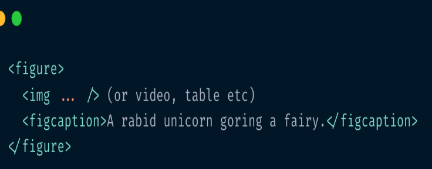

## Mark

highlight text


## Audio

represents a sound or audio stream


`
type/mp3 optional`

## Video

represents video or movie


`type/mp4 is optional`


## Forms

A form on a web page allows a user to enter data that is sent to a server for processing

contains elements like `buttons, checkboxes, texfeilds, radio buttons, dropdown menus ,`etc

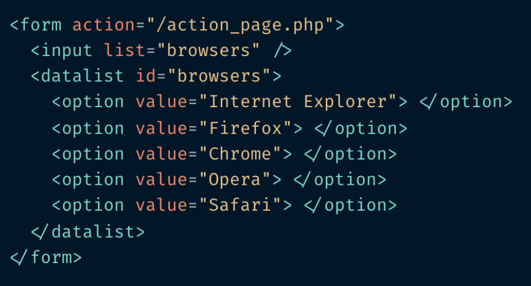

## attributes
* `action='url'` specifies where to send the data when submit button is clicked 
* `method ='get'` sent as url with limt 100 chars
* `method ='post'` sent as urk and cannot be bookmarked by most browsers 
* `target = 'target'` tells where to open the page 
* `target ="_blank"`
* `target = "_top"`
  
| Feature                      | `method="get"`                                         | `method="post"`                                       |
|------------------------------|--------------------------------------------------------|------------------------------------------------------|
| **Data Transmission**        | Data is sent as part of the URL in the query string.  | Data is sent in the body of the HTTP request.       |
| **URL Format**               | URL includes the form data after a question mark `?`. | URL does not include form data.                       |
| **Data Limit**               | Limited to a few thousand characters (typically <2000). | No significant limit on data size (limited by server). |
| **Visibility**               | Data is visible in the browser’s address bar.         | Data is not visible in the URL.                      |
| **Bookmarking**              | Can be bookmarked since the data is in the URL.       | Cannot be bookmarked by most browsers.               |
| **Data Type**                | Only ASCII data is suitable; special characters need URL encoding. | Can handle binary data, and does not require encoding. |
| **Security**                 | Less secure; data is exposed in the URL.               | More secure for sensitive information (e.g., passwords). |
| **Caching**                  | Can be cached by the browser.                          | Generally not cached.                                 |
| **Use Cases**                | Suitable for non-sensitive data, like search queries. | Suitable for sensitive data, file uploads, or large amounts of data. |

### Conclusion

- **GET** is primarily used for retrieving data and is suitable for non-sensitive information where bookmarking is required.
- **POST** is used for sending data to the server, especially when handling sensitive information or larger datasets.


| Feature                   | `<button>`                                   | `<input type="submit">`                          |
|---------------------------|----------------------------------------------|--------------------------------------------------|
| **Element Type**          | Standard HTML element                        | Input type specifically for form submission      |
| **Content**               | Can contain HTML content (text, images, etc.) | Only accepts text as a value                     |
| **Flexibility**           | More flexible; can be styled and formatted with HTML and CSS | Limited styling options                            |
| **Event Handling**        | Supports more event handling options (e.g., click events) | Primarily triggers form submission on click      |
| **Default Behavior**      | Does not submit the form unless specified with JavaScript | Automatically submits the form when clicked       |
| **Accessibility**         | Can be enhanced with ARIA roles and attributes for better accessibility | Standard behavior recognized by assistive technologies |
| **Use Case**              | Ideal for buttons that perform actions other than submitting forms | Specifically for submitting forms to the server   |
| **Form Association**      | Can be associated with a form using the `form` attribute | Automatically associated with the nearest form element |

### Conclusion

- Use `<button>` when you need more control over the content and behavior of the button.
- Use `<input type="submit">` when you want a straightforward button for submitting forms.


## `<fieldset>, <legend>` tag

The fieldset is useful tool for organizing and grouping related items


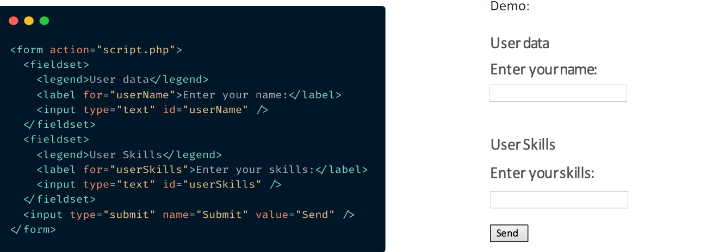

## input tag

The input element represent a `typed data field `

typed data field means we can add attribute as type 


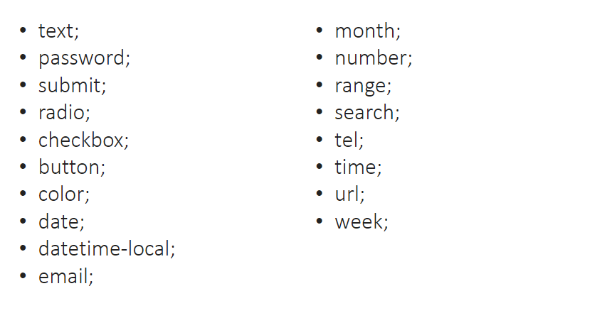

## textarea
multiline plain text 

-attributes
cols, rows


deafult value without cols and rows means the user can expand

## Buttons


## Checkbox
- attributes
`type
name
value`

- can select multiple values

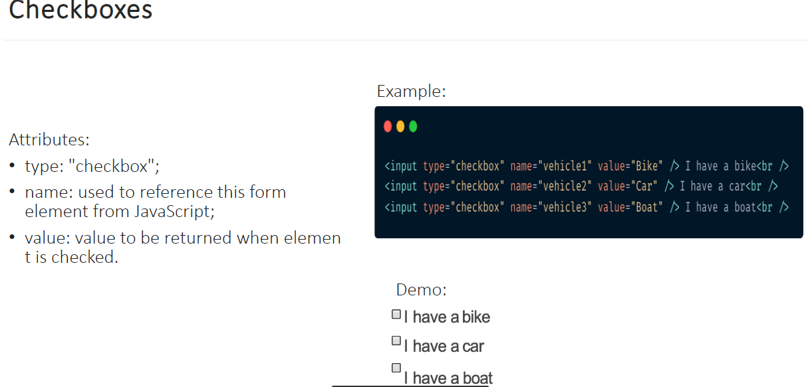

## Radio buttons
- can select only one value
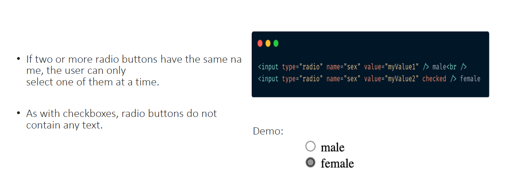


## select element

- represents a control that provides a menu of options
- should have value attribute if` not given` the `text contains will be submited`

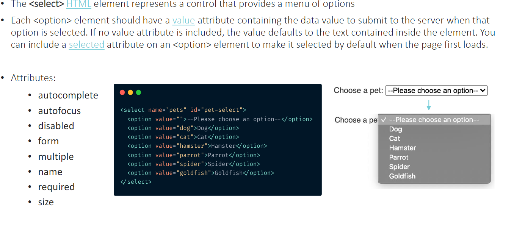

## Data List
 specifies a list of pre-defined options for input element

 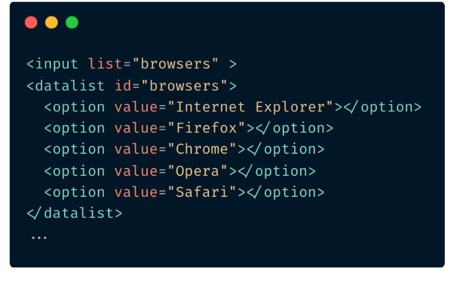

 ## labels

 represens caption for an item in a user interface

 accociating label with input element offers some advatages

 - making easier for user for entering data
 - focousing into input feild
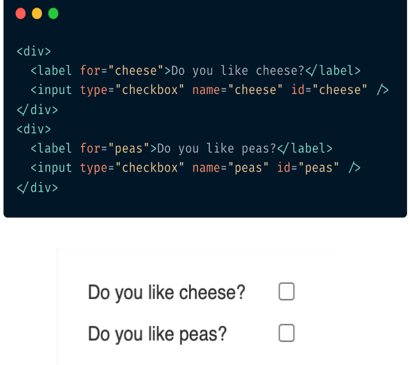

## hidden feilds

all input fiels are sent to server including hidden they can set programmatically by js before submitting
 - not visible to user


### Type Number


### Type Range


### Attributes for Input


### Pattren type in input

```html
<form>
  <label for="password">Password:</label>
  <input type="password" id="password" name="password"
         pattern="(?=.*\d)(?=.*[a-z])(?=.*[A-Z])(?=.*[@#$%^&+=]).{8,}" 
         title="Must contain at least one uppercase letter, one lowercase letter, one number, one special character, and be at least 8 characters long" 
         required>
  <input type="submit">
</form>
```

### Progres tag

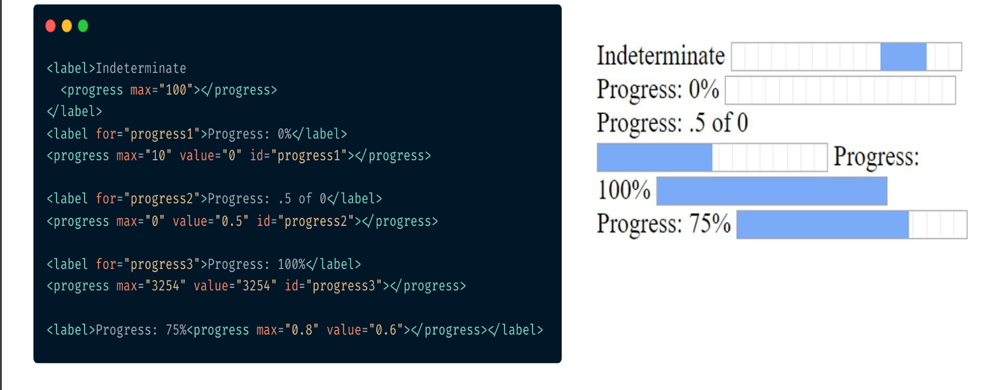

### tag `<picture>`

servers as a container for 0 or more `<source>` elements and one `` element to provive versions of an image for different display device scenarios

- browser consider each of child `<source>` elements if no elemts there means file specified by `` element's src attribute is selected.

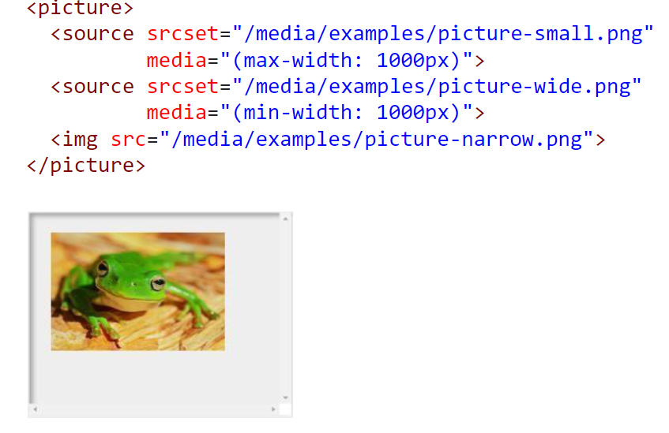

### Srcset image attribute for `` tag

Allows you to list multiple alternative image sources which vary in pixel density
This allows the browser to pick an image of the appropriate quality for the user’s device.


### Difference between picuture and srcset attribute

| Feature                 | `<picture>` Element                            | `srcset` Attribute for `` Tag            |
|-------------------------|------------------------------------------------|----------------------------------------------|
| **Primary Use**          | Choose images based on screen size, format, or other media conditions | Choose image based on resolution (DPR)       |
| **Supported Attributes** | `<source>` can use `media`, `srcset`, and `type` | `srcset` attribute only                      |
| **Control Mechanism**    | Media queries or file formats (e.g., WebP, JPEG) | Pixel density (1x, 2x, 3x, etc.)             |
| **Fallback**             | Fallback to `` if no `<source>` matches   | Fallback to `src` if no appropriate `srcset` |
| **Complexity**           | More complex but more versatile for different display scenarios | Simpler, good for handling varying resolutions |

## Canvas and Svg
 - Completely integrated intoHTML5documents (part of DOM)
 - Can be styled with CSS
 - Can be controlled with JavaScript
 - Use for animation, charts, images, pixel manipulation,and soon
 - Canvas supports 2D and 3D(WebGL)
### Canvas
 - The HTML `<canvas>` element is used to draw graphics, on the fly, via JavaScript.
 - The `<canvas>` element is only a container for graphic
 - Canvas has several methods for drawing paths, boxes, circles, text, and adding images

**Disadvantages**
- requries js
- not seo- friendly 


## Key Methods and Functions

### `getContext()`
- Returns a drawing context, which can be used to draw shapes, text, images, and other objects.
- Common contexts:
  - `'2d'` for 2D rendering
  - `'webgl'` for 3D rendering

### Shapes
- **`fillRect(x, y, width, height)`**: Draws a filled rectangle.
- **`strokeRect(x, y, width, height)`**: Draws an outlined rectangle.
- **`clearRect(x, y, width, height)`**: Clears the specified rectangle, making it transparent.

### Paths
- **`beginPath()`**: Starts a new path.
- **`moveTo(x, y)`**: Moves the starting point of the path.
- **`lineTo(x, y)`**: Creates a line to the specified coordinates.
- **`stroke()`**: Draws the path.

### Text
- **`fillText(text, x, y)`**: Draws filled text.
- **`strokeText(text, x, y)`**: Draws outlined text.

### Images
- **`drawImage(img, x, y)`**: Draws an image on the canvas at the specified position.


## examples
- rectangle
```html
<canvas id="myCanvas" width="400" height="300" style="border:1px solid #000000;">
  Your browser does not support the HTML5 canvas tag.
</canvas>

<script>
  var canvas = document.getElementById('myCanvas');
  var ctx = canvas.getContext('2d');

  // Draw a rectangle
  ctx.fillStyle = "#FF0000";
  ctx.fillRect(50, 50, 150, 100);
</script>
```
- circle
```html
<canvas id="circleCanvas" width="400" height="300"></canvas>

<script>
  var canvas = document.getElementById('circleCanvas');
  var ctx = canvas.getContext('2d');

  // Draw a circle
  ctx.beginPath();
  ctx.arc(150, 150, 75, 0, 2 * Math.PI);  // x, y, radius, startAngle, endAngle
  ctx.stroke();  // Outline the circle
</script>

```

## Scalable Vector Graphics(SVG)

SVG stands for Scalable Vector Graphics and it is a language for describing 2D-graphics and graphical applications in XML and the XML is then rendered by an SVG viewer.

- Provide native drawing functionality
- Completely integrated into HTML5 documents (part of DOM)
- Can be styled with CSS
- Can be controlled with JavaScript
- SVG is used to define graphics for the Web
- SVG is a W3C recommendation

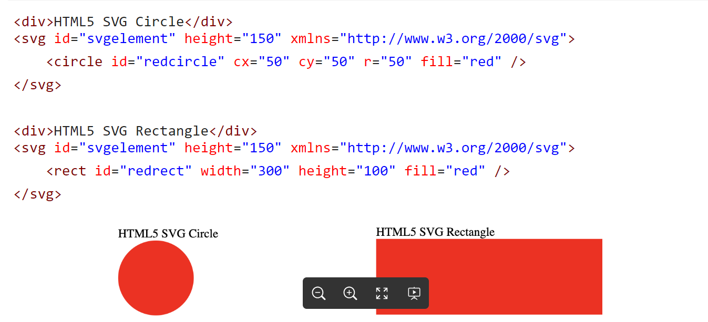

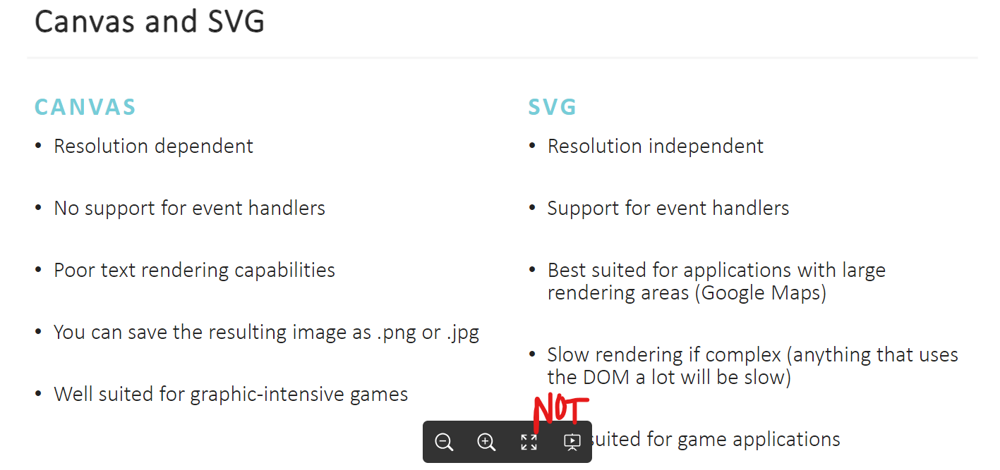

## HTML5 Shiv (or Shim)
HTML5 Shiv (also known as HTML5 Shim) is a JavaScript workaround that enables older browsers (especially Internet Explorer 6-8) to recognize and style HTML5 elements like `<article>, <section>, <header>, <footer>,` etc., which are not natively supported by these browsers.

Without the shiv, these older browsers treat new HTML5 elements as unknown elements and won't apply CSS to them.

#### Why it's important:
`Older browsers`: Without HTML5 Shiv, many of the new semantic elements introduced in HTML5 wouldn't be recognized by older versions of Internet Explorer.

`Improved SEO & Accessibility`: Using semantic HTML5 elements improves SEO and accessibility for modern websites.

- include in head
```html
<!--[if lt IE 9]>
  <script src="https://cdnjs.cloudflare.com/ajax/libs/html5shiv/3.7.3/html5shiv.js"></script>
<![endif]-->
```

#### Why is important
`Older browsers: `Without HTML5 Shiv, many of the new semantic elements introduced in HTML5 wouldn't be recognized by older versions of Internet Explorer.

`Improved SEO & Accessibility:` Using semantic HTML5 elements improves SEO and accessibility for modern websites.

### HMTL Linter

An HTML linter is a tool or software that analyzes HTML code to identify potential errors, coding style issues, and best practices.

## features

- syntax checking 
- best practies (depreceated tags alternativew)
- accessibility checks (missing alt for image)

HTML Linters examples

1. HTMLHint 
   ```html
   npm install htmlhint -g
   htmlhint yourfile.html
   ```
2. W3C Validator 

### Semantic HTML

Semantic HTML refers to the use of HTML markup that conveys meaning and structure to web content. 

-  It involves using appropriate HTML elements to ensure that the content is understandable not only by browsers but also by search engines and assistive technologies like screen readers.
-  seo benefits

### ARIA (Accessible Rich Internet Applications)

ARIA is a set of attributes designed to make web content and web applications more accessible, particularly for people with disabilities. 

- It provides additional information about elements that are not inherently accessible or when the semantics of HTML are not enough.

**attributes**
- ` role ` Defines the purpose of an element (`e.g., role="button"`).
- `state` Communicates the current state of an element (`e.g., aria-expanded="true"`).
- `property`  Provides additional information about an element (`e.g., aria-label="Close"`).

- example
```html
<button role='button' aria-expanded="false" aria-label="Show more options">More Options</button>
```

## Lighthouse
Lighthouse is an open-source, automated tool developed by Google for improving the quality of web pages. 

-It performs audits across various categories including performance, accessibility, SEO, and best practices.

#### How to Use Lighthouse:

`In Chrome DevTools:` Open DevTools, navigate to the "Lighthouse" tab, select categories, and generate a report.

`Command Line Interface:` Install Lighthouse via npm and run it against a URL.

Example Command:
```bash
npm install -g lighthouse
lighthouse https://example.com
```

### Screen readers
screen readers are assistive technologies that convet digital text to synthesized speeh.

- TEXT to Speech
- keyboad navigation

#### Popular screen readers

- `JAWS(Job Access With Speech)`: A widely used screen reader for Windows, known for its robust features and extensive support.

- `NVDA (NonVisual Desktop Access)`: A free, open-source screen reader for Windows that provides essential functionalities and is widely adopted by users.
